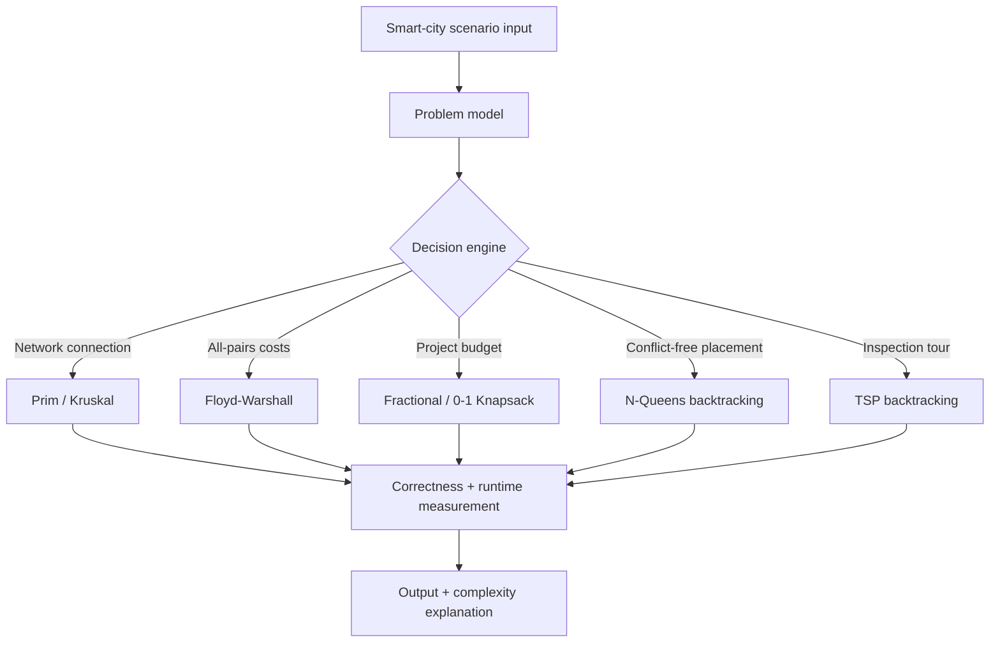

# Algorithm 2035 architecture

```mermaid
flowchart TD
    A[Smart-city scenario input] --> B[Problem model]
    B --> C{Decision engine}
    C -->|Network connection| D[Prim / Kruskal]
    C -->|All-pairs costs| E[Floyd-Warshall]
    C -->|Project budget| F[Fractional / 0-1 Knapsack]
    C -->|Conflict-free placement| G[N-Queens backtracking]
    C -->|Inspection tour| H[TSP backtracking]
    D --> I[Correctness + runtime measurement]
    E --> I
    F --> I
    G --> I
    H --> I
    I --> J[Output + complexity explanation]
```
